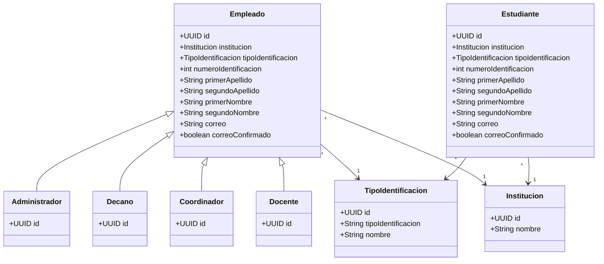

# Diagrama de Clases (Orientado a Objetos)

Especificación del modelo de clases del sistema.

```mermaid
classDiagram
    class TipoIdentificacion {
        +UUID id
        +String tipoIdentificacion
        +String nombre
    }

    class Empleado {
        +UUID id
        +Institucion institucion
        +TipoIdentificacion tipoIdentificacion
        +int numeroIdentificacion
        +String primerApellido
        +String segundoApellido
        +String primerNombre
        +String segundoNombre
        +String correo
        +boolean correoConfirmado
    }

    class Administrador {
        +UUID id
    }

    class Decano {
        +UUID id
    }

    class Coordinador {
        +UUID id
    }

    class Docente {
        +UUID id
    }

    class Estudiante {
        +UUID id
        +Institucion institucion
        +TipoIdentificacion tipoIdentificacion
        +int numeroIdentificacion
        +String primerApellido
        +String segundoApellido
        +String primerNombre
        +String segundoNombre
        +String correo
        +boolean correoConfirmado
    }

    class Institucion {
        +UUID id
        +String nombre
    }

    Empleado <|-- Administrador
    Empleado <|-- Decano
    Empleado <|-- Coordinador
    Empleado <|-- Docente
    Empleado "*" --> "1" TipoIdentificacion
    Empleado "*" --> "1" Institucion
    Estudiante "*" --> "1" TipoIdentificacion
    Estudiante "*" --> "1" Institucion
```
