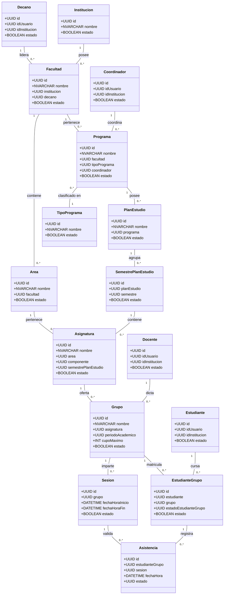

# Diagrama de Dominio (Modelo Conceptual)

Documentación del Modelo de Dominio del Sistema de Gestión de Asistencias.

```mermaid
classDiagram
    class Institucion {
        +UUID id
        +NVARCHAR nombre
        +BOOLEAN estado
    }

    class Facultad {
        +UUID id
        +NVARCHAR nombre
        +UUID institucion
        +UUID decano
        +BOOLEAN estado
    }

    class Decano {
        +UUID id
        +UUID idUsuario
        +UUID idInstitucion
        +BOOLEAN estado
    }

    class Coordinador {
        +UUID id
        +UUID idUsuario
        +UUID idInstitucion
        +BOOLEAN estado
    }

    class Programa {
        +UUID id
        +NVARCHAR nombre
        +UUID facultad
        +UUID tipoPrograma
        +UUID coordinador
        +BOOLEAN estado
    }

    class TipoPrograma {
        +UUID id
        +NVARCHAR nombre
        +BOOLEAN estado
    }

    class Area {
        +UUID id
        +NVARCHAR nombre
        +UUID facultad
        +BOOLEAN estado
    }

    class PlanEstudio {
        +UUID id
        +NVARCHAR nombre
        +UUID programa
        +BOOLEAN estado
    }

    class SemestrePlanEstudio {
        +UUID id
        +UUID planEstudio
        +UUID semestre
        +BOOLEAN estado
    }

    class Asignatura {
        +UUID id
        +NVARCHAR nombre
        +UUID area
        +UUID componente
        +UUID semestrePlanEstudio
        +BOOLEAN estado
    }

    class Grupo {
        +UUID id
        +NVARCHAR nombre
        +UUID asignatura
        +UUID periodoAcademico
        +INT cupoMaximo
        +BOOLEAN estado
    }

    class Docente {
        +UUID id
        +UUID idUsuario
        +UUID idInstitucion
        +BOOLEAN estado
    }

    class Estudiante {
        +UUID id
        +UUID idUsuario
        +UUID idInstitucion
        +BOOLEAN estado
    }

    class EstudianteGrupo {
        +UUID id
        +UUID estudiante
        +UUID grupo
        +UUID estadoEstudianteGrupo
        +BOOLEAN estado
    }

    class Sesion {
        +UUID id
        +UUID grupo
        +DATETIME fechaHoraInicio
        +DATETIME fechaHoraFin
        +BOOLEAN estado
    }

    class Asistencia {
        +UUID id
        +UUID estudianteGrupo
        +UUID sesion
        +DATETIME fechaHora
        +UUID estado
    }

    Institucion "1" -- "0..*" Facultad : posee
    Facultad "1" -- "0..*" Programa : pertenece
    Programa "1" -- "0..*" PlanEstudio : posee
    Programa "0..*" -- "1" TipoPrograma : clasificado en
    Facultad "1" -- "0..*" Area : contiene
    Area "1" -- "0..*" Asignatura : pertenece
    PlanEstudio "1" -- "0..*" SemestrePlanEstudio : agrupa
    SemestrePlanEstudio "1" -- "0..*" Asignatura : contiene
    Asignatura "1" -- "0..*" Grupo : oferta
    Grupo "1" -- "0..*" EstudianteGrupo : matricula
    Estudiante "1" -- "0..*" EstudianteGrupo : cursa
    Grupo "1" -- "0..*" Sesion : imparte
    EstudianteGrupo "1" -- "0..*" Asistencia : registra
    Sesion "1" -- "0..*" Asistencia : valida
    Docente "1" -- "0..*" Grupo : dicta
    Decano "1" -- "0..*" Facultad : lidera
    Coordinador "1" -- "0..*" Programa : coordina
```
