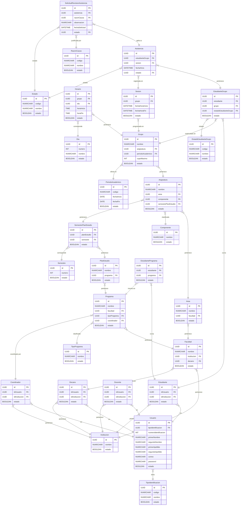

# Diagrama de Entidad Relación (MER) - Especificación del Esquema

Especificación técnica de entidades, claves primarias y foráneas del modelo de base de datos.

```mermaid
erDiagram
    Usuario {
        UUID id PK
        UUID tipoIdentificacion FK
        INT numeroIdentificacion
        NVARCHAR primerNombre
        NVARCHAR segundoNombre
        NVARCHAR primerApellido
        NVARCHAR segundoApellido
        NVARCHAR correo
        NVARCHAR password
        BOOLEAN estado
    }

    TipoIdentificacion {
        UUID id PK
        NVARCHAR codigo
        NVARCHAR nombre
        BOOLEAN estado
    }

    Institucion {
        UUID id PK
        NVARCHAR nombre
        BOOLEAN estado
    }

    Facultad {
        UUID id PK
        NVARCHAR nombre
        UUID institucion FK
        UUID decano FK
        BOOLEAN estado
    }

    Decano {
        UUID id PK
        UUID idUsuario FK
        UUID idInstitucion FK
        BOOLEAN estado
    }

    Coordinador {
        UUID id PK
        UUID idUsuario FK
        UUID idInstitucion FK
        BOOLEAN estado
    }

    Programa {
        UUID id PK
        NVARCHAR nombre
        UUID facultad FK
        UUID tipoPrograma FK
        UUID coordinador FK
        BOOLEAN estado
    }

    TipoPrograma {
        UUID id PK
        NVARCHAR nombre
        BOOLEAN estado
    }

    Area {
        UUID id PK
        NVARCHAR nombre
        UUID facultad FK
        BOOLEAN estado
    }

    Componente {
        UUID id PK
        NVARCHAR nombre
        BOOLEAN estado
    }

    PlanEstudio {
        UUID id PK
        NVARCHAR nombre
        UUID programa FK
        BOOLEAN estado
    }

    Semestre {
        UUID id PK
        INT numero
        BOOLEAN estado
    }

    SemestrePlanEstudio {
        UUID id PK
        UUID planEstudio FK
        UUID semestre FK
        BOOLEAN estado
    }

    Asignatura {
        UUID id PK
        NVARCHAR nombre
        UUID area FK
        UUID componente FK
        UUID semestrePlanEstudio FK
        BOOLEAN estado
    }

    PeriodoAcademico {
        UUID id PK
        NVARCHAR codigo
        DATE fechaInicio
        DATE fechaFin
        BOOLEAN estado
    }

    Grupo {
        UUID id PK
        NVARCHAR nombre
        UUID asignatura FK
        UUID periodoAcademico FK
        INT cupoMaximo
        BOOLEAN estado
    }

    Docente {
        UUID id PK
        UUID idUsuario FK
        UUID idInstitucion FK
        BOOLEAN estado
    }

    Estudiante {
        UUID id PK
        UUID idUsuario FK
        UUID idInstitucion FK
        BOOLEAN estado
    }

    EstadoEstudianteGrupo {
        UUID id PK
        NVARCHAR codigo
        NVARCHAR nombre
        BOOLEAN estado
    }

    EstudianteGrupo {
        UUID id PK
        UUID estudiante FK
        UUID grupo FK
        UUID estadoEstudianteGrupo FK
        BOOLEAN estado
    }

    EstudiantePrograma {
        UUID id PK
        UUID estudiante FK
        UUID programa FK
        BOOLEAN estado
    }

    Dia {
        UUID id PK
        INT numero
        NVARCHAR nombre
        BOOLEAN estado
    }

    Horario {
        UUID id PK
        UUID grupo FK
        UUID dia FK
        TIME horaInicio
        TIME horaFin
        BOOLEAN estado
    }

    Sesion {
        UUID id PK
        UUID grupo FK
        DATETIME fechaHoraInicio
        DATETIME fechaHoraFin
        BOOLEAN estado
    }

    Estado {
        UUID id PK
        NVARCHAR codigo
        NVARCHAR nombre
        BOOLEAN estado
    }

    Asistencia {
        UUID id PK
        UUID estudianteGrupo FK
        UUID sesion FK
        DATETIME fechaHora
        UUID estado FK
    }

    RazonCausa {
        UUID id PK
        NVARCHAR codigo
        NVARCHAR nombre
        BOOLEAN estado
    }

    SolicitudRevisionAsistencia {
        UUID id PK
        UUID asistencia FK
        UUID razonCausa FK
        NVARCHAR observacion
        DATETIME fechaSolicitud
        UUID estado FK
    }

    Usuario }|--|| TipoIdentificacion : "tiene"
    Decano }|--|| Usuario : "es"
    Decano }|--|| Institucion : "pertenece"
    Coordinador }|--|| Usuario : "es"
    Coordinador }|--|| Institucion : "pertenece"
    Docente }|--|| Usuario : "es"
    Docente }|--|| Institucion : "pertenece"
    Estudiante }|--|| Usuario : "es"
    Estudiante }|--|| Institucion : "pertenece"
    Facultad }|--|| Institucion : "pertenece"
    Facultad }|--|| Decano : "liderada por"
    Programa }|--|| Facultad : "pertenece"
    Programa }|--|| TipoPrograma : "clasificado"
    Programa }|--|| Coordinador : "coordinado por"
    Area }|--|| Facultad : "pertenece"
    PlanEstudio }|--|| Programa : "pertenece"
    SemestrePlanEstudio }|--|| PlanEstudio : "pertenece"
    SemestrePlanEstudio }|--|| Semestre : "corresponde"
    Asignatura }|--|| Area : "pertenece"
    Asignatura }|--|| Componente : "clasificada"
    Asignatura }|--|| SemestrePlanEstudio : "pertenece"
    Grupo }|--|| Asignatura : "pertenece"
    Grupo }|--|| PeriodoAcademico : "oferta en"
    EstudianteGrupo }|--|| Estudiante : "cursa"
    EstudianteGrupo }|--|| Grupo : "matriculado en"
    EstudianteGrupo }|--|| EstadoEstudianteGrupo : "estado"
    EstudiantePrograma }|--|| Estudiante : "cursa"
    EstudiantePrograma }|--|| Programa : "inscrito en"
    Horario }|--|| Grupo : "pertenece"
    Horario }|--|| Dia : "corresponde"
    Sesion }|--|| Grupo : "programada en"
    Asistencia }|--|| EstudianteGrupo : "pertenece"
    Asistencia }|--|| Sesion : "registrada en"
    Asistencia }|--|| Estado : "estado"
    SolicitudRevisionAsistencia }|--|| Asistencia : "aplica a"
    SolicitudRevisionAsistencia }|--|| RazonCausa : "justificada por"
    SolicitudRevisionAsistencia }|--|| Estado : "estado"
```
