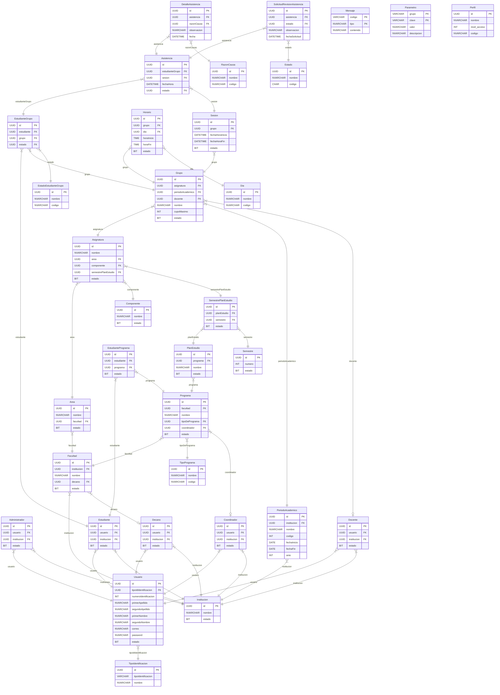

# Diagrama de Entidad Relación (MER) - Especificación del Esquema

Especificación técnica de las 33 entidades, claves primarias, claves foráneas y catálogos sueltos del modelo de base de datos (`gestionasistenciadb`).

