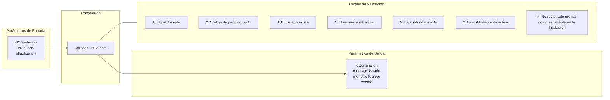

# Transacción: Agregar Estudiante

Documentación de la transacción para registrar el rol de estudiante a un usuario dentro de una institución.

## 📥 Parámetros de Entrada

| Parámetro | Tipo | Requerido | Descripción |
| :--- | :--- | :---: | :--- |
| `idCorrelacion` | `UUID` | Sí | Identificador de trazabilidad de la transacción |
| `idUsuario` | `UUID` | Sí | Identificador del usuario |
| `idInstitucion` | `UUID` | Sí | Identificador de la institución educativa |

---

## 📤 Parámetros de Salida

| Parámetro | Tipo | Descripción |
| :--- | :--- | :--- |
| `idCorrelacion` | `UUID` | Identificador de trazabilidad retornado |
| `mensajeUsuario` | `NVARCHAR` | Mensaje descriptivo para la interfaz de usuario |
| `mensajeTecnico` | `NVARCHAR` | Mensaje técnico de auditoría o error |
| `estado` | `BIT` | Estado de la transacción (`1` = Éxito, `0` = Fallo) |

---

## 📋 Reglas de Negocio y Validaciones

1. El perfil debe existir en el sistema.
2. El código del perfil debe ser el correcto.
3. El usuario debe existir.
4. El usuario debe estar en estado activo.
5. La institución debe existir.
6. La institución debe estar activa.
7. El usuario no debe estar agregado previamente como estudiante en la misma institución.

---

## 📊 Diagrama de Transacción (Mermaid)

