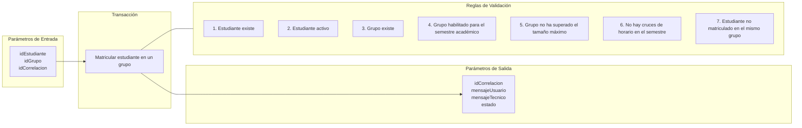

# Transacción: Matricular Estudiante en un Grupo

Documentación de la transacción para enrolar a un estudiante en un grupo académico específico.

## 📥 Parámetros de Entrada

| Parámetro | Tipo | Requerido | Descripción |
| :--- | :--- | :---: | :--- |
| `idEstudiante` | `UUID` | Sí | Identificador del estudiante |
| `idGrupo` | `UUID` | Sí | Identificador del grupo académico |
| `idCorrelacion` | `UUID` | Sí | Identificador de trazabilidad de la transacción |

---

## 📤 Parámetros de Salida

| Parámetro | Tipo | Descripción |
| :--- | :--- | :--- |
| `idCorrelacion` | `UUID` | Identificador de trazabilidad retornado |
| `mensajeUsuario` | `NVARCHAR` | Mensaje descriptivo para la interfaz de usuario |
| `mensajeTecnico` | `NVARCHAR` | Mensaje técnico de auditoría o error |
| `estado` | `BIT` | Estado de la transacción (`1` = Éxito, `0` = Fallo) |

---

## 📋 Reglas de Negocio y Validaciones

1. El estudiante debe existir.
2. El estudiante debe estar activo.
3. El grupo debe existir.
4. El grupo debe estar habilitado para el semestre académico deseado.
5. El grupo no debe haber superado su capacidad/tamaño máximo.
6. El grupo no debe cruzarse en el mismo horario de otro grupo en el que ya esté matriculado el estudiante para el mismo semestre académico.
7. El estudiante no debe estar matriculado previamente en el mismo grupo.

---

## 📊 Diagrama de Transacción (Mermaid)

