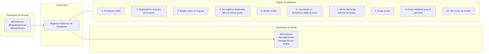

# Transacción: Registrar Asistencia Estudiante Clase Específica

Documentación de la transacción para registrar la asistencia de un estudiante a una sesión o clase programada.

## 📥 Parámetros de Entrada

| Parámetro | Tipo | Requerido | Descripción |
| :--- | :--- | :---: | :--- |
| `idCorrelacion` | `UUID` | Sí | Identificador de trazabilidad de la transacción |
| `idEstudianteGrupo` | `UUID` | Sí | Registro de relación estudiante-grupo |
| `idGrupoSesion` | `UUID` | Sí | Identificador de la sesión de clase |

---

## 📤 Parámetros de Salida

| Parámetro | Tipo | Descripción |
| :--- | :--- | :--- |
| `idCorrelacion` | `UUID` | Identificador de trazabilidad retornado |
| `mensajeUsuario` | `NVARCHAR` | Mensaje descriptivo para la interfaz de usuario |
| `mensajeTecnico` | `NVARCHAR` | Mensaje técnico de auditoría o error |
| `estado` | `BIT` | Estado de la transacción (`1` = Éxito, `0` = Fallo) |

---

## 📋 Reglas de Negocio y Validaciones

1. El estudiante debe existir.
2. El estudiante debe estar registrado en el grupo correspondiente a la sesión.
3. El estudiante debe tener estado activo en el grupo de la sesión.
4. El estudiante no puede tener más de un registro de asistencia para la misma sesión.
5. La sesión debe existir.
6. La sesión debe estar ocurriendo dentro de la fecha y hora de inicio de registro de la asistencia.
7. Debe registrarse la asistencia dentro del rango máximo de tiempo permitido.
8. El grupo debe existir.
9. El grupo debe estar habilitado para el semestre académico deseado.
10. El grupo no debe cruzarse en el mismo horario de otro grupo en el que el estudiante ya esté matriculado para el mismo semestre.

> 📝 **Nota de Diseño**: ¿Cómo controlar el registro de `fechaHoraInicio` y `fechaHoraFin`?

---

## 📊 Diagrama de Transacción (Mermaid)

