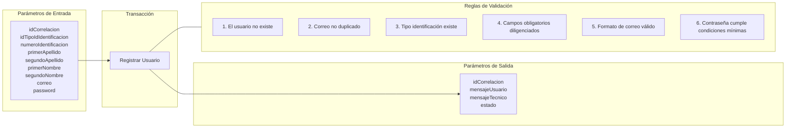

# Transacción: Registrar Usuario

Documentación de la transacción para el registro de un nuevo usuario en el sistema.

## 📥 Parámetros de Entrada

| Parámetro | Tipo | Requerido | Descripción |
| :--- | :--- | :---: | :--- |
| `idCorrelacion` | `UUID` | Sí | Identificador de trazabilidad de la transacción |
| `idTipoIdIdentificacion` | `UUID` | Sí | Tipo de documento de identidad del usuario |
| `numeroIdentificacion` | `INT` | Sí | Número de documento de identidad |
| `primerApellido` | `NVARCHAR` | Sí | Primer apellido |
| `segundoApellido` | `NVARCHAR` | No | Segundo apellido |
| `primerNombre` | `NVARCHAR` | Sí | Primer nombre |
| `segundoNombre` | `NVARCHAR` | No | Segundo nombre |
| `correo` | `NVARCHAR` | Sí | Correo electrónico |
| `password` | `NVARCHAR` | Sí | Contraseña de acceso |

---

## 📤 Parámetros de Salida

| Parámetro | Tipo | Descripción |
| :--- | :--- | :--- |
| `idCorrelacion` | `UUID` | Identificador de trazabilidad retornado |
| `mensajeUsuario` | `NVARCHAR` | Mensaje descriptivo para la interfaz de usuario |
| `mensajeTecnico` | `NVARCHAR` | Mensaje técnico de auditoría o error |
| `estado` | `BIT` | Estado de la transacción (`1` = Éxito, `0` = Fallo) |

---

## 📋 Reglas de Negocio y Validaciones

1. El usuario no debe existir en el sistema.
2. El correo no debe estar registrado con otro usuario.
3. El tipo de identificación debe existir.
4. Los campos obligatorios (`primerNombre`, `primerApellido`, `numeroIdentificacion`, `correo`, `password`) deben estar diligenciados.
5. El formato del correo debe cumplir con una estructura válida.
6. La contraseña debe cumplir con las condiciones mínimas de seguridad.

---

## 📊 Diagrama de Transacción (Mermaid)

