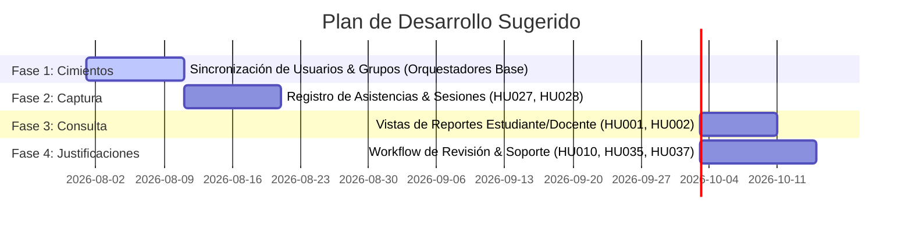

# Priorización e Impacto de Historias de Usuario: Sistema de Gestión de Asistencias 🚀

Este documento analiza el impacto de las historias de usuario de la base de datos `gestionasistenciadb` y define una ruta lógica de implementación basada en dependencias técnicas y valor de negocio.

---

## 🎯 Criterios de Priorización

Para determinar qué historias de usuario deben abordarse primero, utilizamos tres criterios clave:
1.  **Valor de Negocio (Core):** Funcionalidades indispensables para el funcionamiento básico del sistema (registro y consulta de asistencia).
2.  **Dependencia Técnica:** Historias que sirven como cimiento para otras (ej. no se puede registrar asistencia en un grupo si el estudiante no está inscrito en él).
3.  **Frecuencia de Uso:** Funcionalidades que los usuarios principales (docentes y estudiantes) utilizarán diariamente.

---

## 🔑 Historias de Usuario de Mayor Impacto

Hemos agrupado las historias críticas en cuatro pilares de alto impacto:

### 1. Registro y Captura de Asistencia (Flujo Principal)
Representan el corazón transaccional del sistema. Sin estas, no hay datos que procesar.
*   **HU027 / HU033 (Docente):** *Registrar asistencia de un estudiante a una clase específica.*
    *   **Impacto:** Permite al docente llevar el control individual o masivo de las asistencias por sesión.
*   **HU028 / HU029 (Docente):** *Registrar la asistencia de una sesión / Registro detallado.*
    *   **Impacto:** Permite cerrar y consolidar el estado de una sesión de clase completa.

### 2. Consulta y Transparencia para el Estudiante (Acceso a Información)
Permiten a los estudiantes conocer su estado académico y evitar sorpresas de reprobación por inasistencias.
*   **HU001 / HU013 (Estudiante):** *Ver los detalles de las asistencias.*
    *   **Impacto:** Proporciona visibilidad en tiempo real del porcentaje de ausentismo y estado actual.
*   **HU002 / HU009 (Estudiante):** *Consultar los registros de asistencia.*
    *   **Impacto:** Permite validar de manera preventiva las fechas y firmas de asistencia del periodo.

### 3. Gestión de Excepciones y Justificaciones (Workflow de Corrección)
Resuelven la fricción del día a día por faltas justificadas o errores humanos en el registro.
*   **HU010 / HU014 (Estudiante):** *Registrar una nueva solicitud de revisión de asistencia.*
    *   **Impacto:** Permite al estudiante solicitar correcciones y adjuntar soportes físicos/médicos.
*   **HU035 / HU037 (Docente):** *Buscar, ver y aprobar solicitudes de revisión de asistencia.*
    *   **Impacto:** Permite al docente auditar la justificación y actualizar el estado de la asistencia en base de datos.

### 4. Monitoreo y Alertas Tempranas (Oversight Académico)
Funcionalidades clave para que los coordinadores y decanos tomen decisiones estratégicas y eviten la deserción estudiantil.
*   **HU066 (Coordinador) / HU102 (Decano):** *Consultar registros de asistencia e inasistencias reiteradas.*
    *   **Impacto:** Permite detectar patrones de estudiantes en riesgo académico por ausentismo recurrente.

---

## 🗺️ Hoja de Ruta de Implementación (Roadmap)

Recomendamos abordar el desarrollo en **4 fases lógicas**:

### 📍 Fase 1: Cimientos y Orquestación Base (Sprints 1-2)
*   **Objetivo:** Asegurar que los datos maestros estén sincronizados.
*   **Qué hacer:** Implementar y probar procedimientos almacenados de base como `usp_registrar_estudiante_en_grupo_usuario_no_existente` y `usp_registrar_estudiante_en_programa_interno`.
*   **Historias asociadas:** Historias de gestión de entidades base (`Estudiante`, `Docente`, `Grupo`, `Sesión`).

### 📍 Fase 2: Control Transaccional de Asistencia (Sprints 3-4)
*   **Objetivo:** Permitir que los docentes recolecten la información en las clases.
*   **Qué hacer:** Desarrollar los triggers y procedimientos para insertar registros en la tabla `Asistencia` y validar consistencias (ej. que la sesión pertenezca al grupo y esté en el rango de fecha/hora correspondiente).
*   **Historias asociadas:** `HU027`, `HU028`, `HU029`, `HU033`, `HU034`.

### 📍 Fase 3: Consultas y Notificaciones (Sprint 5)
*   **Objetivo:** Exponer la información recolectada de forma amigable.
*   **Qué hacer:** Optimizar las vistas de base de datos (`uv_estudiante`, `uv_asistencia`) y crear funciones escalares para calcular porcentajes de inasistencia en tiempo real.
*   **Historias asociadas:** `HU001`, `HU002`, `HU040`, `HU041`, `HU066`.

### 📍 Fase 4: Flujo de Novedades y Justificaciones (Sprints 6-7)
*   **Objetivo:** Resolver el flujo de justificaciones y reclamos.
*   **Qué hacer:** Implementar las tablas de novedades (`SolicitudRevisionAsistencia`) y los procedimientos de actualización de estados aprobados con auditoría de modificación.
*   **Historias asociadas:** `HU010`, `HU011`, `HU014`, `HU035`, `HU037`.
