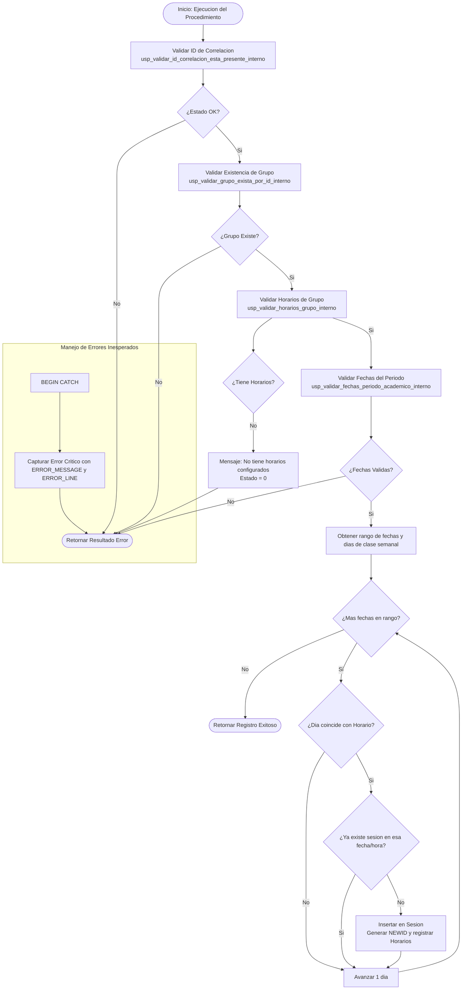

# Documentacion: `usp_generar_sesiones_grupo`

Este documento contiene la especificacion y el flujo detallado de ejecucion del procedimiento almacenado `usp_generar_sesiones_grupo` y sus sub-procedimientos de soporte.

---

## 📌 Descripcion General

El procedimiento `usp_generar_sesiones_grupo` se encarga de crear de forma masiva todas las fechas de clase (sesiones) en la tabla `Sesion` para un grupo especifico. Utiliza la informacion de programacion semanal definida en `Horario` y los limites temporales del `PeriodoAcademico` del grupo para iterar sobre el rango de fechas y registrar las sesiones individuales correspondientes.

### Parametros de Entrada
| Parametro | Tipo | Descripcion |
| :--- | :--- | :--- |
| `@idGrupo` | `UNIQUEIDENTIFIER` | ID del grupo para el cual se generaran las sesiones |
| `@idCorrelacion` | `UNIQUEIDENTIFIER` | ID de trazabilidad/correlacion de la transaccion |

### Parametros de Salida (Resultado del Query)
- `id` (`UNIQUEIDENTIFIER`)
- `mensajeUsuarioResultado` (`NVARCHAR(4000)`)
- `mensajeTecnicoResultado` (`NVARCHAR(4000)`)
- `estadoResultado` (`BIT`)

---

## ⚙️ Procedimientos Internos Relacionados

Para mantener la modularidad y el principio de responsabilidad unica, la orquestacion se apoya en los siguientes sub-procedimientos:

1. **`usp_validar_grupo_exista_por_id_interno`**: Valida la existencia del grupo y obtiene su informacion academica.
2. **`usp_validar_horarios_grupo_interno` [NUEVO]**: Verifica que el grupo tenga al menos un horario semanal asignado en la tabla `Horario` antes de intentar la generacion.
3. **`usp_validar_fechas_periodo_academico_interno` [NUEVO]**: Comprueba que la fecha de inicio del periodo academico sea menor a la fecha de fin y que ambas esten correctamente configuradas.

---

## 📊 Diagrama de Flujo de Ejecucion (Mermaid)

---

## 🔁 Resumen de Pasos de Orquestacion

1. **Validacion Inicial**:
   - Comprueba la validez del `@idCorrelacion`.
   - Verifica la existencia y consistencia basica del grupo llamando a `usp_validar_grupo_exista_por_id_interno`.
2. **Validacion de Prerrequisitos**:
   - Llama a `usp_validar_horarios_grupo_interno` para comprobar que el grupo tenga asignados dias de clase (ej. Lunes y Miercoles) en `Horario`.
   - Llama a `usp_validar_fechas_periodo_academico_interno` para extraer y validar los limites de fecha `fechaInicio` y `fechaFin` del `PeriodoAcademico` vinculado al grupo.
3. **Iteracion y Generacion de Sesiones**:
   - Inicia un bucle temporal (`WHILE`) desde `fechaInicio` hasta `fechaFin`.
   - Por cada fecha de la iteracion, determina el dia de la semana (ej. usando `DATEPART(dw, @currentDate)`).
   - Compara este dia con los horarios semanales definidos para el grupo. Si hay coincidencia, realiza un `INSERT` en la tabla `Sesion` (omitiendo duplicaciones si la sesion ya existia previamente).
4. **Resumen de Resultados**:
   - Finaliza devolviendo un mensaje con el total de sesiones creadas/verificadas.
