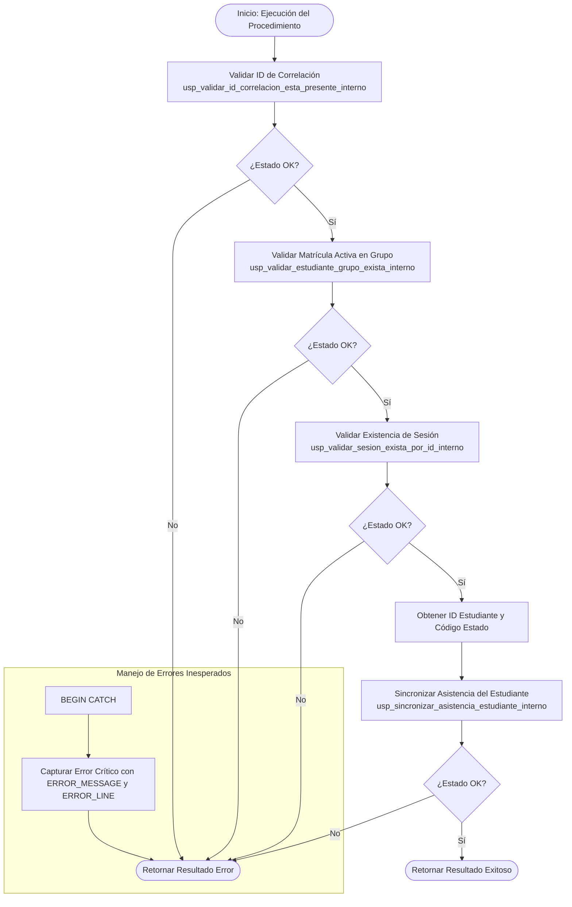

# Documentación: `usp_registrar_asistencia_estudiante`

Este documento contiene la especificación y el flujo detallado de ejecución del procedimiento almacenado orquestador `usp_registrar_asistencia_estudiante`.

---

## 📌 Descripción General

El procedimiento `usp_registrar_asistencia_estudiante` es la transacción orquestadora encargada de registrar o modificar de manera individual la asistencia de un estudiante inscrito a una sesión de clase específica. Es utilizado habitualmente por docentes y administradores desde su panel de control.

### Parámetros de Entrada
| Parámetro | Tipo | Descripción |
| :--- | :--- | :--- |
| `@idEstudianteGrupo` | `UNIQUEIDENTIFIER` | ID del enrolamiento/matrícula del estudiante en el grupo |
| `@idGrupoSesion` | `UNIQUEIDENTIFIER` | ID de la sesión de clase programada |
| `@idEstadoAsistencia` | `UNIQUEIDENTIFIER` | ID del estado de asistencia (Asistió, Faltó, Tarde, Justificado) |
| `@idCorrelacion` | `UNIQUEIDENTIFIER` | ID de trazabilidad/correlación de la transacción |

### Parámetros de Salida (Resultado del Query)
- `@mensajeUsuarioResultado` (`NVARCHAR(4000)`)
- `@mensajeTecnicoResultado` (`NVARCHAR(4000)`)
- `@estadoResultado` (`BIT`)

---

## 📊 Diagrama de Flujo de Ejecución (Mermaid)

---

## 🔁 Resumen de Pasos de Orquestación

1.  **Validación de Correlación**: Verifica que el `@idCorrelacion` esté presente y sea válido.
2.  **Validación de Matrícula**: Llama a `usp_validar_estudiante_grupo_exista_interno` para comprobar que la relación entre el estudiante y el grupo sea válida y activa.
3.  **Validación de Sesión**: Llama a `usp_validar_sesion_exista_por_id_interno` para comprobar que la sesión de clase exista y esté vigente.
4.  **Obtención de Datos**: Recupera el identificador único del estudiante (`estudiante`) y el código correspondiente al estado de asistencia.
5.  **Persistencia / Sincronización**: Llama al procedimiento interno `usp_sincronizar_asistencia_estudiante_interno` para insertar o actualizar el estado en la tabla `Asistencia`.
6.  **Retorno**: Devuelve el recordset final con el estado de ejecución y mensajes.
