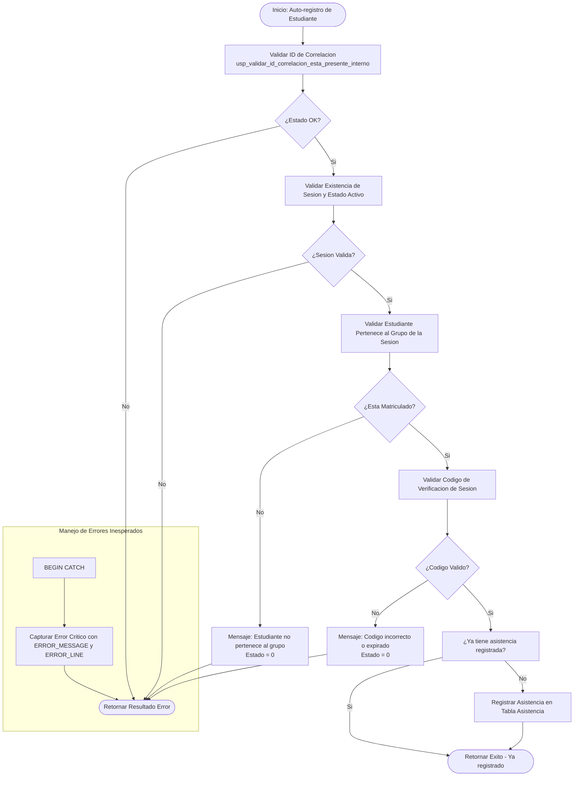

# Documentacion: `usp_registrar_asistencia_estudiante_autonomo`

Este documento contiene la especificacion y el flujo de ejecucion del procedimiento almacenado `usp_registrar_asistencia_estudiante_autonomo`, diseñado para permitir que cada estudiante registre su propia asistencia de manera individual (auto-registro) a una sesion de clase especifica.

---

## 📌 Descripcion General

El procedimiento `usp_registrar_asistencia_estudiante_autonomo` permite a un estudiante registrar su presencia en una sesion de clase activa. Para garantizar la seguridad del proceso y evitar fraudes, el procedimiento valida:
1. La existencia de una matricula activa del estudiante en el grupo correspondiente.
2. Que la sesion de clase este activa y abierta para registro en el momento de la ejecucion.
3. El ingreso de un codigo de verificacion temporal generado por el docente para esa sesion (opcional/configurable).

### Parametros de Entrada
| Parametro | Tipo | Descripcion |
| :--- | :--- | :--- |
| `@idEstudiante` | `UNIQUEIDENTIFIER` | ID del estudiante que registra su asistencia |
| `@idSesion` | `UNIQUEIDENTIFIER` | ID de la sesion de clase para la cual se auto-registra |
| `@codigoVerificacion` | `NVARCHAR(10)` | Codigo dinámico/temporal de seguridad dictado por el docente |
| `@idCorrelacion` | `UNIQUEIDENTIFIER` | ID de trazabilidad/correlacion de la transaccion |

### Parametros de Salida (Resultado del Query)
- `id` (`UNIQUEIDENTIFIER`): ID de la asistencia generada o actualizada.
- `mensajeUsuarioResultado` (`NVARCHAR(4000)`): Mensaje descriptivo para el estudiante en su idioma.
- `mensajeTecnicoResultado` (`NVARCHAR(4000)`): Detalle tecnico en caso de error.
- `estadoResultado` (`BIT`): `1` si el registro fue exitoso, `0` en caso contrario.

---

## ⚙️ Validaciones de Seguridad y Negocio

1. **Existencia del Estudiante y Matricula**: El estudiante debe estar registrado y tener una relacion activa con el grupo al que pertenece la sesion (`EstudianteGrupo`).
2. **Ventana de Tiempo Activa**: La sesion debe estar en curso o dentro de un margen de tolerancia predefinido (ej. desde 15 minutos antes hasta el final de la clase).
3. **Codigo de Verificacion**: Si la sesion tiene configurado un codigo de verificacion activo en la tabla `Sesion`, el valor de `@codigoVerificacion` debe coincidir exactamente.
4. **Evitar Duplicados**: Si el estudiante ya tiene un registro de asistencia para esta sesion, se retorna el ID existente con exito sin duplicar filas.

---

## 📊 Diagrama de Flujo de Ejecucion (Mermaid)

---

## 🔁 Resumen de Pasos de Orquestacion

1. **Validacion de Entrada**: Comprobacion del identificador de correlacion.
2. **Chequeo de Sesion y Horario**: Valida que la sesion este abierta y dentro de las horas correspondientes.
3. **Validacion de Enrolamiento**: Busca la relacion entre `@idEstudiante` y el grupo de la sesion para asegurar que no pertenezca a otra clase.
4. **Verificacion de Codigo**: Compara el `@codigoVerificacion` provisto contra el guardado temporalmente en la sesion actual.
5. **Registro de Asistencia**: Inserta la fila en la tabla `Asistencia` con el estado `A` (Asistió) y la marca de tiempo de insercion.
