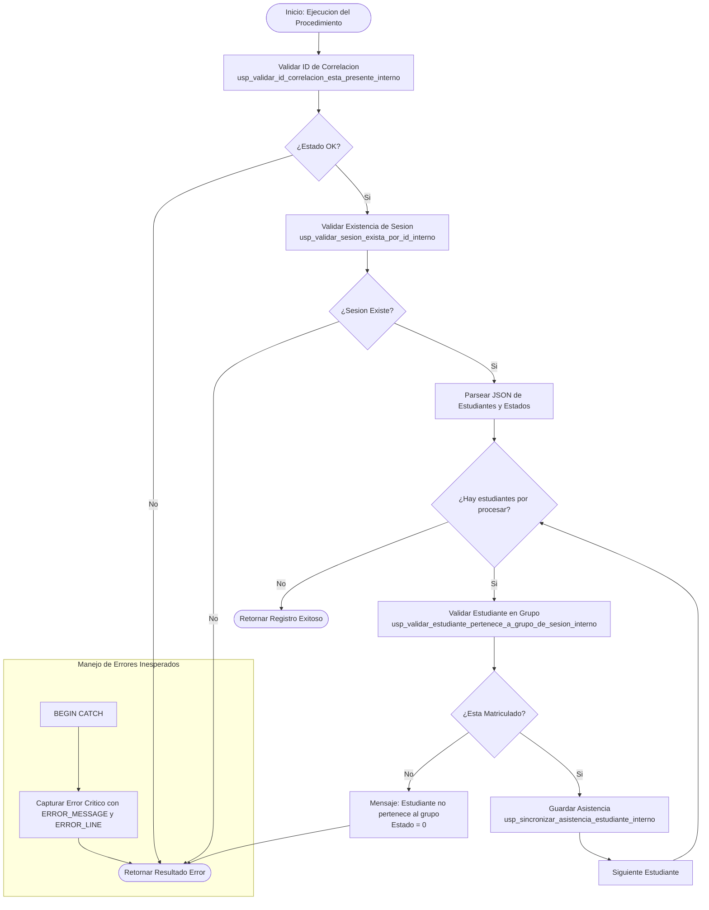

# Documentacion: `usp_registrar_asistencias_sesion`

Este documento contiene la especificacion y el flujo detallado de ejecucion del procedimiento almacenado `usp_registrar_asistencias_sesion` y sus sub-procedimientos de soporte.

---

## 📌 Descripcion General

El procedimiento `usp_registrar_asistencias_sesion` permite a un docente registrar la asistencia de los estudiantes asignados a un grupo para una sesion de clase especifica. Para facilitar la integracion con APIs y el paso masivo de datos, recibe la informacion en una estructura estructurada y valida que cada estudiante este matriculado en el grupo de la sesion antes de guardar los datos en la tabla `Asistencia`.

### Parametros de Entrada
| Parametro | Tipo | Descripcion |
| :--- | :--- | :--- |
| `@idSesion` | `UNIQUEIDENTIFIER` | ID de la sesion de clase para la cual se registra asistencia |
| `@asistenciaJSON` | `NVARCHAR(MAX)` | JSON con la lista de estudiantes e inasistencias (ej. `[{"idEstudiante":"...", "estado":"A"}, ...]`) |
| `@idCorrelacion` | `UNIQUEIDENTIFIER` | ID de trazabilidad/correlacion de la transaccion |

### Parametros de Salida (Resultado del Query)
- `id` (`UNIQUEIDENTIFIER`)
- `mensajeUsuarioResultado` (`NVARCHAR(4000)`)
- `mensajeTecnicoResultado` (`NVARCHAR(4000)`)
- `estadoResultado` (`BIT`)

---

## ⚙️ Procedimientos Internos Relacionados

Para mantener la modularidad y el principio de responsabilidad unica, la orquestacion se apoya en los siguientes sub-procedimientos:

1. **`usp_validar_sesion_exista_por_id_interno` [NUEVO]**: Valida que la sesion exista en la tabla `Sesion` y este en estado valido (activa/no cancelada).
2. **`usp_validar_estudiante_pertenece_a_grupo_de_sesion_interno` [NUEVO]**: Verifica que los estudiantes contenidos en el JSON esten formalmente inscritos en el grupo asociado a la sesion en `EstudianteGrupo`.
3. **`usp_sincronizar_asistencia_estudiante_interno` [NUEVO]**: Realiza la insercion de nuevos registros o la actualizacion de registros existentes en la tabla `Asistencia`.

---

## 📊 Diagrama de Flujo de Ejecucion (Mermaid)

---

## 🔁 Resumen de Pasos de Orquestacion

1. **Validacion Inicial**:
   - Comprueba la validez del `@idCorrelacion`.
   - Verifica la existencia y estado de la sesion llamando a `usp_validar_sesion_exista_por_id_interno`.
2. **Procesamiento de Estudiantes**:
   - Parsea el parámetro `@asistenciaJSON` utilizando la función `OPENJSON` de SQL Server para extraer la lista de tuplas `(idEstudiante, estado)`.
3. **Validacion de Matricula por Estudiante**:
   - Por cada fila del JSON, valida que exista un registro activo de matricula en la tabla `EstudianteGrupo` vinculando al estudiante con el grupo correspondiente a la sesion (`usp_validar_estudiante_pertenece_a_grupo_de_sesion_interno`).
4. **Persistencia / Sincronizacion de Asistencia**:
   - Invoca a `usp_sincronizar_asistencia_estudiante_interno`. Si ya existe una asistencia registrada para ese estudiante en esa sesion (por ejemplo, si el docente realiza una correccion de asistencia), actualiza el estado (`A`, `F`, `T`, `J`). De lo contrario, inserta una nueva fila con un identificador único (`NEWID()`).
5. **Resultado Final**:
   - Devuelve un conjunto de resultados con el estado exitoso de la operacion.
