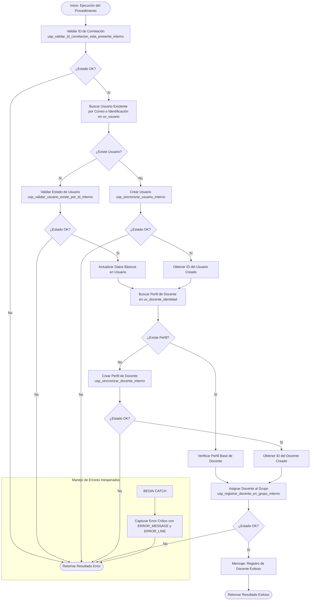

# Documentación: `usp_registrar_docente_en_grupo_usuario_no_existente`

Este documento contiene la especificación y el flujo detallado de ejecución del procedimiento almacenado orquestador `usp_registrar_docente_en_grupo_usuario_no_existente`.

---

## 📌 Descripción General

El procedimiento `usp_registrar_docente_en_grupo_usuario_no_existente` actúa como **orquestador principal** para dar de alta o actualizar a un usuario, asegurar su perfil como docente y asignarlo como docente titular de un grupo académico.

### Parámetros de Entrada
| Parámetro | Tipo | Descripción |
| :--- | :--- | :--- |
| `@tipoIdIdentificacion` | `UNIQUEIDENTIFIER` | ID del tipo de identificación |
| `@numeroIdentificacion` | `INT` | Número de documento |
| `@primerApellido` | `NVARCHAR(255)` | Primer apellido |
| `@segundoApellido` | `NVARCHAR(255)` | Segundo apellido (opcional) |
| `@primerNombre` | `NVARCHAR(255)` | Primer nombre |
| `@segundoNombre` | `NVARCHAR(255)` | Segundo nombre (opcional) |
| `@correo` | `NVARCHAR(255)` | Correo electrónico institucional / personal |
| `@password` | `NVARCHAR(MAX)` | Contraseña del usuario |
| `@idGrupo` | `UNIQUEIDENTIFIER` | ID del grupo al que se asignará |
| `@idCorrelacion` | `UNIQUEIDENTIFIER` | ID de trazabilidad/correlación de la transacción |

### Parámetros de Salida (Resultado del Query)
- `@idUsuarioCreado` (`UNIQUEIDENTIFIER` / Interno)
- `@mensajeUsuarioResultado` (`NVARCHAR(4000)`)
- `@mensajeTecnicoResultado` (`NVARCHAR(4000)`)
- `@estadoResultado` (`BIT`)

---

## 📊 Diagrama de Flujo de Ejecución (Mermaid)

---

## 🔁 Resumen de Pasos de Orquestación

1.  **Validación de Correlación**: Valida que `@idCorrelacion` sea válido llamando a `usp_validar_id_correlacion_esta_presente_interno`.
2.  **Búsqueda e Identificación**: Consulta en `uv_usuario` usando el correo electrónico o la identificación física.
3.  **Actualización o Sincronización**:
    *   Si el usuario ya existe, valida que esté habilitado mediante `usp_validar_usuario_existe_por_id_interno` y actualiza sus datos en `Usuario`.
    *   Si no existe, se ejecuta `usp_sincronizar_usuario_interno`.
4.  **Asegurar Perfil Docente**: Comprueba que el usuario tenga un registro asociado en `uv_docente_identidad`. En caso negativo, ejecuta `usp_sincronizar_docente_interno`.
5.  **Enrolamiento en el Grupo**: Llama a `usp_registrar_docente_en_grupo_interno` para vincularlo formalmente como docente titular.
6.  **Respuestas**: Retorna un recordset con los resultados de la operación (`id`, `mensajeUsuarioResultado`, `mensajeTecnicoResultado`, `estadoResultado`).
