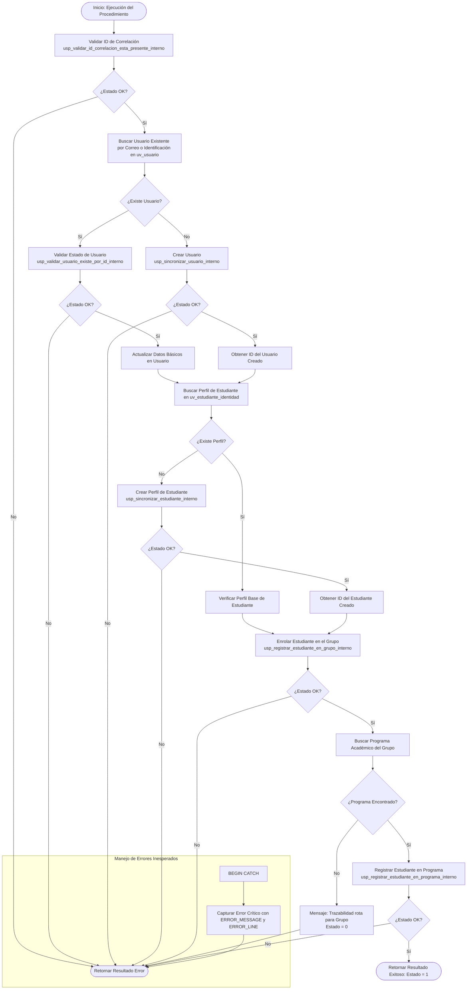

# Documentación: `usp_registrar_estudiante_en_grupo_usuario_no_existente`

Este documento contiene la especificación y el flujo detallado de ejecución del procedimiento almacenado orquestador `usp_registrar_estudiante_en_grupo_usuario_no_existente`.

---

## 📌 Descripción General

El procedimiento `usp_registrar_estudiante_en_grupo_usuario_no_existente` actúa como **orquestador principal** para dar de alta o actualizar a un usuario, asegurar su perfil como estudiante, enrolarlo en un grupo académico y registrarlo en su programa correspondiente.

### Parámetros de Entrada
| Parámetro | Tipo | Descripción |
| :--- | :--- | :--- |
| `@tipoIdIdentificacion` | `UNIQUEIDENTIFIER` | ID del tipo de identificación |
| `@numeroIdentificacion` | `INT` | Número de documento |
| `@primerApellido` | `NVARCHAR(255)` | Primer apellido |
| `@segundoApellido` | `NVARCHAR(255)` | Segundo apellido (opcional) |
| `@primerNombre` | `NVARCHAR(255)` | Primer nombre |
| `@segundoNombre` | `NVARCHAR(255)` | Segundo nombre (opcional) |
| `@correo` | `NVARCHAR(255)` | Correo electrónico institucional / personal |
| `@password` | `NVARCHAR(MAX)` | Contraseña del usuario |
| `@idGrupo` | `UNIQUEIDENTIFIER` | ID del grupo en el que se enrolará |
| `@idCorrelacion` | `UNIQUEIDENTIFIER` | ID de trazabilidad/correlación de la transacción |

### Parámetros de Salida (Resultado del Query)
- `@idUsuarioCreado` (`UNIQUEIDENTIFIER` / Interno)
- `@mensajeUsuarioResultado` (`NVARCHAR(4000)`)
- `@mensajeTecnicoResultado` (`NVARCHAR(4000)`)
- `@estadoResultado` (`BIT`)

---

## 📊 Diagrama de Flujo de Ejecución (Mermaid)

---

## 🔁 Resumen de Pasos de Orquestación

1. **Validación Inicial**: Verifica que exista `@idCorrelacion`.
2. **Gestión de Usuario**:
   - Si el usuario existe, valida su estado activo y actualiza nombres/apellidos.
   - Si no existe, invoca `usp_sincronizar_usuario_interno`.
3. **Gestión de Estudiante**:
   - Verifica existencia en `uv_estudiante_identidad`.
   - Si no existe, invoca `usp_sincronizar_estudiante_interno`.
4. **Enrolamiento en Grupo**:
   - Invoca `usp_registrar_estudiante_en_grupo_interno`.
5. **Asignación de Programa**:
   - Resuelve el programa académico correspondiente al grupo mediante `uv_grupo -> uv_asignatura -> uv_semestre_plan_estudio -> uv_plan_estudio`.
   - Invoca `usp_registrar_estudiante_en_programa_interno`.
