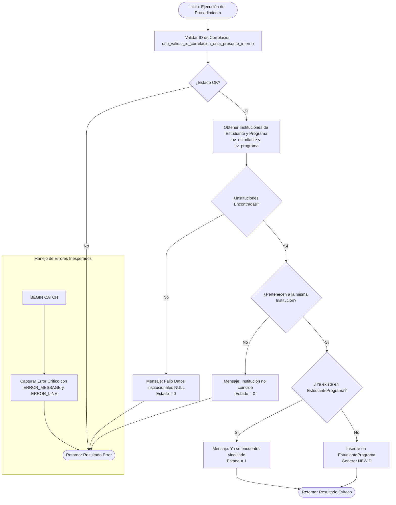

# Documentación: `usp_registrar_estudiante_en_programa_interno`

Este documento contiene la especificación y el flujo detallado de ejecución del procedimiento almacenado interno `usp_registrar_estudiante_en_programa_interno`.

---

## 📌 Descripción General

El procedimiento `usp_registrar_estudiante_en_programa_interno` se encarga de asociar a un estudiante con un programa académico específico en la tabla de relación `EstudiantePrograma`. Para asegurar la integridad referencial y de negocio, valida que ambos pertenezcan a la misma institución y que no exista una matrícula previa para ese programa.

### Parámetros de Entrada
| Parámetro | Tipo | Descripción |
| :--- | :--- | :--- |
| `@idEstudiante` | `UNIQUEIDENTIFIER` | ID del estudiante a registrar |
| `@idPrograma` | `UNIQUEIDENTIFIER` | ID del programa académico en el que se inscribirá |
| `@idCorrelacion` | `UNIQUEIDENTIFIER` | ID de trazabilidad/correlación de la transacción |

### Parámetros de Salida (Resultado del Query)
- `@mensajeUsuarioResultado` (`NVARCHAR(4000)`)
- `@mensajeTecnicoResultado` (`NVARCHAR(4000)`)
- `@estadoResultado` (`BIT`)

---

## 📊 Diagrama de Flujo de Ejecución (Mermaid)

---

## 🔁 Resumen de Pasos de Orquestación

1. **Validación Inicial**: Verifica que exista `@idCorrelacion`.
2. **Obtención de Instituciones**:
   - Consulta `uv_estudiante` para obtener `idInstitucion` del estudiante.
   - Consulta `uv_programa` para obtener `idInstitucion` del programa y de la facultad relacionada.
3. **Validación de Consistencia**:
   - Si no se encuentran datos de institución para el estudiante o para el programa (retornan `NULL`), la validación falla.
   - Valida que la institución del estudiante sea igual a la del programa, y que la del programa coincida con la de la facultad.
4. **Verificación de Duplicados**:
   - Comprueba si existe un registro en `EstudiantePrograma` para el mismo estudiante y programa.
   - Si ya existe, finaliza con éxito (`@estadoResultado = 1`) indicando que ya está registrado para evitar errores por duplicidad.
5. **Registro de Matrícula**:
   - Realiza la inserción física en la tabla `EstudiantePrograma` asignando un nuevo identificador único (`NEWID()`).
