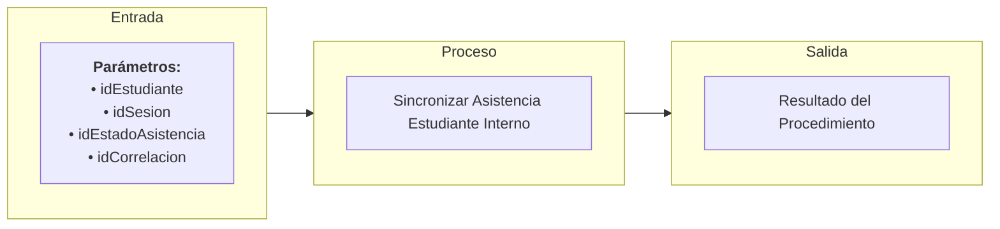

# Transacción Interna: Sincronizar Asistencia Estudiante

Documentación del procedimiento interno para guardar (insertar o actualizar) la asistencia de un estudiante a una sesión de clase.

---

## 📥 Parámetros de Entrada

| Parámetro | Tipo | Requerido | Descripción |
| :--- | :--- | :---: | :--- |
| `idEstudiante` | `UUID` | Sí | ID del estudiante |
| `idSesion` | `UUID` | Sí | ID de la sesión de clase |
| `idEstadoAsistencia` | `UUID` | Sí | ID del estado de la asistencia (Asistió, Faltó, Tarde, Justificado) |
| `idCorrelacion` | `UUID` | Sí | ID de trazabilidad de la transacción |

---

## 📤 Parámetros de Salida

| Parámetro | Tipo | Descripción |
| :--- | :--- | :--- |
| `idCorrelacion` | `UUID` | Identificador de trazabilidad retornado |
| `mensajeUsuario` | `NVARCHAR` | Mensaje descriptivo para la interfaz de usuario |
| `mensajeTecnico` | `NVARCHAR` | Mensaje técnico detallado sobre la persistencia |
| `estado` | `BIT` | Estado final de la persistencia (`1` = Éxito, `0` = Fallo) |

---

## 📊 Arquitectura de la Transacción (Entrada - Proceso - Salida)

---

## 📋 Responsabilidades de la Transacción

La transacción es responsable de los siguientes flujos:
*   Verificar la presencia del identificador de correlación.
*   Consultar si ya existe un registro de asistencia en la tabla `Asistencia` para la combinación `idEstudiante` y `idSesion`.
*   Si existe, realizar un UPDATE de la columna de estado.
*   Si no existe, realizar un INSERT de un nuevo registro de asistencia.

---

## 🔍 Reglas de Negocio y Validaciones

### 1. Validaciones Propias de `usp_sincronizar_asistencia_estudiante_interno`
*   **Idempotencia**: Garantiza que no se generen registros duplicados para un mismo estudiante en una misma sesión de clase.
*   **Auditoría**: Debe registrar de manera automática la fecha y hora de la transacción en las marcas de tiempo correspondientes.
