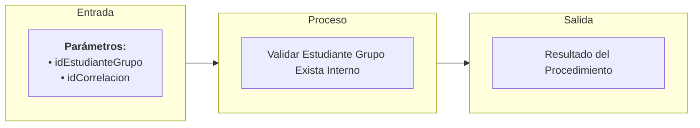

# Transacción Interna: Validar Estudiante Grupo Exista

Documentación del procedimiento interno para verificar la existencia y estado activo de la relación de matrícula de un estudiante en un grupo académico.

---

## 📥 Parámetros de Entrada

| Parámetro | Tipo | Requerido | Descripción |
| :--- | :--- | :---: | :--- |
| `idEstudianteGrupo` | `UUID` | Sí | ID de la matrícula estudiante-grupo a validar |
| `idCorrelacion` | `UUID` | Sí | ID de trazabilidad de la transacción |

---

## 📤 Parámetros de Salida

| Parámetro | Tipo | Descripción |
| :--- | :--- | :--- |
| `idCorrelacion` | `UUID` | Identificador de trazabilidad retornado |
| `mensajeUsuario` | `NVARCHAR` | Mensaje descriptivo para la interfaz de usuario |
| `mensajeTecnico` | `NVARCHAR` | Mensaje técnico detallado sobre el estado de la matrícula |
| `estado` | `BIT` | Resultado de la validación (`1` = Matrícula activa, `0` = No existe o inactiva) |

---

## 📊 Arquitectura de la Transacción (Entrada - Proceso - Salida)

---

## 📋 Responsabilidades de la Transacción

La transacción es responsable de los siguientes flujos:
*   Verificar la presencia del identificador de correlación.
*   Consultar la tabla de matrículas `EstudianteGrupo` por el ID especificado.
*   Validar que el estado de la inscripción del estudiante en el grupo esté activo.

---

## 🔍 Reglas de Negocio y Validaciones

### 1. Validaciones Propias de `usp_validar_estudiante_grupo_exista_interno`
*   **Validación de Inscripción**: Si la matrícula no existe, se retorna `estado = 0` y un mensaje notificando que el estudiante no está inscrito en el grupo.
*   **Validación de Vigencia**: Si la relación existe pero ha sido dada de baja o está inactiva, se retorna `estado = 0`.
