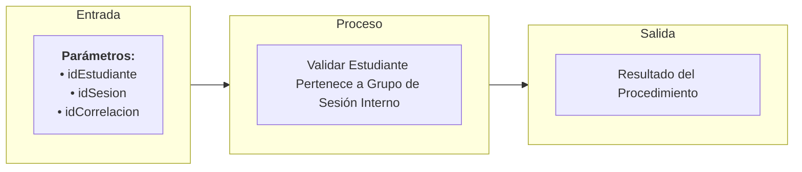

# Transacción Interna: Validar Estudiante Pertenece a Grupo de Sesión

Documentación del procedimiento interno encargado de validar que un estudiante específico se encuentre formalmente matriculado y activo en el grupo al cual corresponde la sesión de clase.

---

## 📥 Parámetros de Entrada

| Parámetro | Tipo | Requerido | Descripción |
| :--- | :--- | :---: | :--- |
| `idEstudiante` | `UUID` | Sí | ID del estudiante a evaluar |
| `idSesion` | `UUID` | Sí | ID de la sesión de clase |
| `idCorrelacion` | `UUID` | Sí | ID de trazabilidad de la transacción |

---

## 📤 Parámetros de Salida

| Parámetro | Tipo | Descripción |
| :--- | :--- | :--- |
| `idCorrelacion` | `UUID` | Identificador de trazabilidad retornado |
| `mensajeUsuario` | `NVARCHAR` | Mensaje descriptivo para la interfaz de usuario |
| `mensajeTecnico` | `NVARCHAR` | Mensaje técnico detallado de la consulta |
| `estado` | `BIT` | Resultado de la validación (`1` = Estudiante pertenece al grupo de la sesión, `0` = No pertenece) |

---

## 📊 Arquitectura de la Transacción (Entrada - Proceso - Salida)

---

## 📋 Responsabilidades de la Transacción

La transacción es responsable de los siguientes flujos:
*   Verificar la presencia del identificador de correlación.
*   Determinar el grupo asociado a la sesión de clase consultando la tabla `Sesion`.
*   Verificar en la tabla `EstudianteGrupo` si existe una relación activa entre el estudiante y dicho grupo.

---

## 🔍 Reglas de Negocio y Validaciones

### 1. Validaciones Propias de `usp_validar_estudiante_pertenece_a_grupo_de_sesion_interno`
*   **Validación de Pertenece**: Si la consulta no retorna coincidencias activas entre el estudiante y el grupo de la sesión de clase, se devuelve `estado = 0` y se deniega el registro de asistencia.
