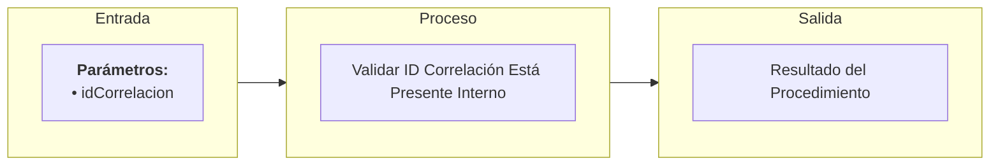

# Transacción Interna: Validar ID de Correlación Está Presente

Documentación del procedimiento interno encargado de garantizar que el identificador de correlación esté presente y sea válido para asegurar la trazabilidad de la transacción.

---

## 📥 Parámetros de Entrada

| Parámetro | Tipo | Requerido | Descripción |
| :--- | :--- | :---: | :--- |
| `idCorrelacion` | `UUID` | Sí | ID de correlación recibido para auditoría y trazabilidad |

---

## 📤 Parámetros de Salida

| Parámetro | Tipo | Descripción |
| :--- | :--- | :--- |
| `mensajeUsuarioResultado` | `NVARCHAR` | Mensaje descriptivo para la interfaz de usuario en caso de error |
| `mensajeTecnicoResultado` | `NVARCHAR` | Mensaje técnico indicando la ausencia del identificador |
| `estadoResultado` | `BIT` | Resultado de la validación (`1` = Correlación presente y válida, `0` = Inválida o nula) |

---

## 📊 Arquitectura de la Transacción (Entrada - Proceso - Salida)

---

## 📋 Responsabilidades de la Transacción

La transacción es responsable de los siguientes flujos:
*   Inicializar los parámetros de salida.
*   Invocar al validador genérico de IDs (`usp_validar_id_interno`).
*   Verificar si el ID de correlación supera satisfactoriamente la validación estructural básica (no nulo, formato UUID válido y no vacío).

---

## 🔍 Reglas de Negocio y Validaciones

### 1. Validaciones Propias de `usp_validar_id_correlacion_esta_presente_interno`
*   **Vitalidad de Trazabilidad**: Si el ID es nulo o corresponde al UUID por defecto vacío (`00000000-0000-0000-0000-000000000000`), el estado resultado se establece en `0` y la ejecución aborta.

### 2. Procedimientos Utilizados y sus Validaciones

*   **`usp_validar_id_interno`**
    *   Validación básica estructural del formato del UUID.
