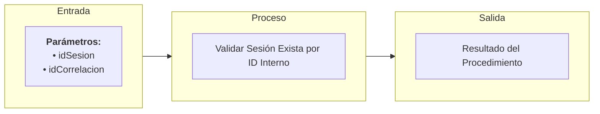

# Transacción Interna: Validar Sesión Exista por ID

Documentación del procedimiento interno encargado de verificar la existencia y el estado operativo/activo de una sesión de clase específica.

---

## 📥 Parámetros de Entrada

| Parámetro | Tipo | Requerido | Descripción |
| :--- | :--- | :---: | :--- |
| `idSesion` | `UUID` | Sí | ID de la sesión de clase a validar |
| `idCorrelacion` | `UUID` | Sí | ID de trazabilidad de la transacción |

---

## 📤 Parámetros de Salida

| Parámetro | Tipo | Descripción |
| :--- | :--- | :--- |
| `idCorrelacion` | `UUID` | Identificador de trazabilidad retornado |
| `mensajeUsuario` | `NVARCHAR` | Mensaje descriptivo para la interfaz de usuario en caso de error |
| `mensajeTecnico` | `NVARCHAR` | Mensaje técnico detallado sobre el estado de la sesión |
| `estado` | `BIT` | Resultado de la validación (`1` = Sesión válida y activa, `0` = No existe o inactiva) |

---

## 📊 Arquitectura de la Transacción (Entrada - Proceso - Salida)

---

## 📋 Responsabilidades de la Transacción

La transacción es responsable de los siguientes flujos:
*   Verificar que el identificador de correlación esté presente.
*   Consultar la tabla `Sesion` buscando por `idSesion`.
*   Validar que la sesión no se encuentre en un estado cancelada o deshabilitada.

---

## 🔍 Reglas de Negocio y Validaciones

### 1. Validaciones Propias de `usp_validar_sesion_exista_por_id_interno`
*   **Validación de Existencia**: Si la sesión no existe, se retorna `estado = 0` y un mensaje indicando que la sesión no es válida.
*   **Validación de Estado**: Si la sesión existe pero su estado es inactivo o cancelado, se retorna `estado = 0` con el respectivo mensaje de error.
