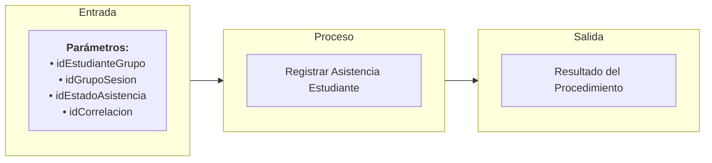

# Transacción: Registrar Asistencia Estudiante

Documentación de la transacción orquestadora para registrar o modificar de manera individual o por evento la asistencia de un estudiante inscrito a una sesión de clase específica.

---

## 📥 Parámetros de Entrada

| Parámetro | Tipo | Requerido | Descripción |
| :--- | :--- | :---: | :--- |
| `idEstudianteGrupo` | `UUID` | Sí | Registro de relación estudiante-grupo (matrícula) |
| `idGrupoSesion` | `UUID` | Sí | ID de la sesión de clase programada |
| `idEstadoAsistencia` | `UUID` | Sí | ID del estado de la asistencia (Asistió, Faltó, Tarde, Justificado) |
| `idCorrelacion` | `UUID` | Sí | ID de trazabilidad/correlación de la transacción |

---

## 📤 Parámetros de Salida

| Parámetro | Tipo | Descripción |
| :--- | :--- | :--- |
| `idCorrelacion` | `UUID` | Identificador de trazabilidad retornado |
| `mensajeUsuario` | `NVARCHAR` | Mensaje descriptivo para la interfaz de usuario |
| `mensajeTecnico` | `NVARCHAR` | Mensaje técnico de auditoría o error detallado |
| `estado` | `BIT` | Estado final de la transacción (`1` = Éxito, `0` = Fallo) |

---

## 📊 Arquitectura de la Transacción (Entrada - Proceso - Salida)

---

## 📋 Responsabilidades de la Transacción

La transacción es responsable de los siguientes flujos:
*   Validar id correlacion esta presente.
*   Validar existencia de matrícula activa.
*   Validar existencia y estado de la sesión programada.
*   Validar si ya existe un registro de asistencia para la sesión.
*   Actualizar el estado si ya existía el registro o insertar un nuevo registro de asistencia si no existía.

---

## 🔍 Reglas de Negocio y Validaciones

### 1. Validaciones Propias de `usp_registrar_asistencia_estudiante`
*   **Validación de Actualización de Estado**: Si ya existe un registro previo para el estudiante en la sesión dada, permite modificar su estado de asistencia (por ejemplo, corregir una inasistencia a justificada).

### 2. Procedimientos Utilizados y sus Validaciones

*   **`usp_validar_id_correlacion_esta_presente_interno`**
    *   Validación de Correlación.

*   **`usp_validar_estudiante_grupo_exista_interno`**
    *   Validación de existencia y estado activo de la matrícula (`EstudianteGrupo`).

*   **`usp_validar_sesion_exista_por_id_interno`**
    *   Validación de existencia y estado habilitado de la sesión programada.
