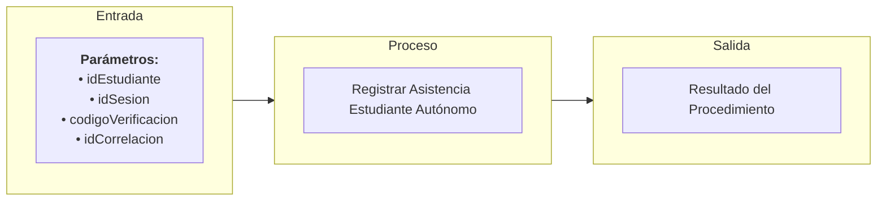

# Transacción: Registrar Asistencia Estudiante (Autónomo)

Documentación de la transacción orquestadora para que un estudiante registre su asistencia en una sesión de clase específica de forma autónoma.

---

## 📥 Parámetros de Entrada

| Parámetro | Tipo | Requerido | Descripción |
| :--- | :--- | :---: | :--- |
| `idEstudiante` | `UUID` | Sí | ID del estudiante que registra su asistencia |
| `idSesion` | `UUID` | Sí | ID de la sesión de clase |
| `codigoVerificacion` | `NVARCHAR` | No | Código dinámico temporal provisto por el docente |
| `idCorrelacion` | `UUID` | Sí | ID de trazabilidad de la transacción |

---

## 📤 Parámetros de Salida

| Parámetro | Tipo | Descripción |
| :--- | :--- | :--- |
| `idCorrelacion` | `UUID` | Identificador de trazabilidad retornado |
| `mensajeUsuario` | `NVARCHAR` | Mensaje descriptivo para la interfaz de usuario |
| `mensajeTecnico` | `NVARCHAR` | Mensaje técnico de auditoría o error detallado |
| `estado` | `BIT` | Estado final de la transacción (`1` = Éxito, `0` = Fallo) |

---

## 📊 Arquitectura de la Transacción (Entrada - Proceso - Salida)

---

## 📋 Responsabilidades de la Transacción

La transacción es responsable de los siguientes flujos:
*   Validar id correlacion esta presente.
*   Validar existencia y estado de la sesión de clase.
*   Validar que el estudiante pertenece al grupo asociado a la sesión.
*   Validar el código dinámico de verificación de la sesión.
*   Verificar si ya existe un registro de asistencia previo para evitar duplicaciones.
*   Registrar/Insertar la asistencia de forma autónoma.

---

## 🔍 Reglas de Negocio y Validaciones

### 1. Validaciones Propias de `usp_registrar_asistencia_estudiante_autonomo`
*   **Validación de Ventana Horaria Activa**: La sesión debe encontrarse dentro de los límites de tiempo programados, incluyendo el margen de tolerancia definido institucionalmente para el registro.
*   **Validación de Código de Verificación**: El código enviado por el estudiante debe coincidir con el código vigente almacenado en la sesión de clase activa.

### 2. Procedimientos Utilizados y sus Validaciones

*   **`usp_validar_id_correlacion_esta_presente_interno`**
    *   Validación de Correlación.

*   **`usp_validar_sesion_exista_por_id_interno`**
    *   Validación de Existencia, Vigencia y Actividad de la Sesión de Clase.

*   **`usp_validar_estudiante_pertenece_a_grupo_de_sesion_interno`**
    *   Validación de Matrícula Activa en el Grupo Correspondiente a la Sesión.

*   **`usp_sincronizar_asistencia_estudiante_interno`**
    *   Validación de No Duplicidad.
    *   Persistencia del estado de asistencia (`A` de Asistió).
