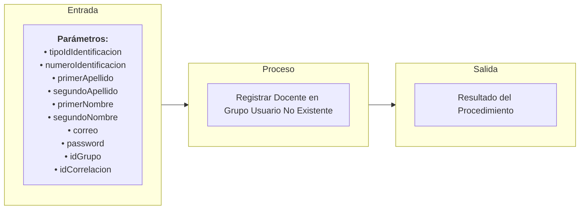

# Transacción: Registrar Docente en Grupo (Usuario No Existente)

Documentación de la transacción orquestadora para dar de alta o actualizar a un usuario, asegurar su rol de docente y asignarlo como el docente titular de un grupo académico.

---

## 📥 Parámetros de Entrada

| Parámetro | Tipo | Requerido | Descripción |
| :--- | :--- | :---: | :--- |
| `tipoIdIdentificacion` | `UUID` | Sí | ID del tipo de documento de identidad |
| `numeroIdentificacion` | `INT` | Sí | Número del documento de identidad |
| `primerApellido` | `NVARCHAR` | Sí | Primer apellido |
| `segundoApellido` | `NVARCHAR` | No | Segundo apellido |
| `primerNombre` | `NVARCHAR` | Sí | Primer nombre |
| `segundoNombre` | `NVARCHAR` | No | Segundo nombre |
| `correo` | `NVARCHAR` | Sí | Dirección de correo electrónico |
| `password` | `NVARCHAR` | No | Contraseña del usuario |
| `idGrupo` | `UUID` | Sí | ID del grupo en el que se registrará el docente |
| `idCorrelacion` | `UUID` | Sí | ID de trazabilidad de la transacción |

---

## 📤 Parámetros de Salida

| Parámetro | Tipo | Descripción |
| :--- | :--- | :--- |
| `idCorrelacion` | `UUID` | Identificador de trazabilidad retornado |
| `mensajeUsuario` | `NVARCHAR` | Mensaje descriptivo para la interfaz de usuario |
| `mensajeTecnico` | `NVARCHAR` | Mensaje técnico de auditoría o error detallado |
| `estado` | `BIT` | Estado final de la transacción (`1` = Éxito, `0` = Fallo) |

---

## 📊 Arquitectura de la Transacción (Entrada - Proceso - Salida)

---

## 📋 Responsabilidades de la Transacción

La transacción es responsable de los siguientes flujos:
*   Validar id correlacion esta presente.
*   Validar si el usuario esta creado.
*   Si existe actualizarlo, de lo contrario crearlo.
*   Sincronizar el rol de docente institucionalmente.
*   Registrar al docente en el grupo asignado.

---

## 🔍 Reglas de Negocio y Validaciones

### 1. Validaciones Propias de `usp_registrar_docente_en_grupo_usuario_no_existente`
*   **Validación de Flujo Orquestador**: Maneja la secuencialidad y consistencia transaccional del proceso completo de registro en bloque.

### 2. Procedimientos Utilizados y sus Validaciones

*   **`usp_validar_id_correlacion_esta_presente_interno`**
    *   Validación de Correlación.

*   **`usp_sincronizar_usuario_interno`**
    *   Validación del Tipo de Documento.
    *   Validación de Unicidad por identificación y correo.
    *   Validación de Formatos.

*   **`usp_sincronizar_docente_interno`**
    *   Validación del Perfil de Docente y asignación de perfil académico.

*   **`usp_registrar_docente_en_grupo_interno`**
    *   Validación de Existencia del Docente.
    *   Validación de Existencia del Grupo.
    *   Validación de Cruces de Horario para el docente en otros grupos.
    *   Validación de Asignación previa del docente al grupo.
