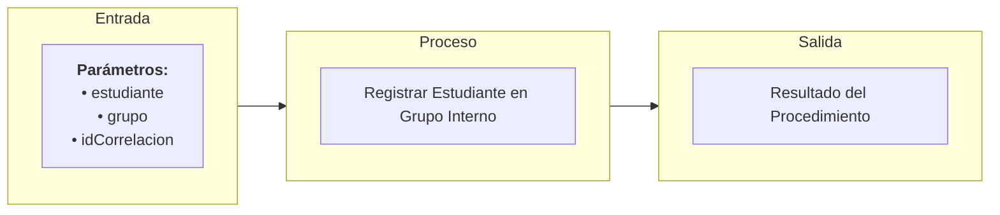

# Transacción: Registrar Estudiante en Grupo Interno

Documentación del procedimiento para inscribir formalmente a un estudiante activo en un grupo académico, validando que el grupo tenga cupo disponible y no se presenten cruces de horarios.

---

## 📥 Parámetros de Entrada

| Parámetro | Tipo | Requerido | Descripción |
| :--- | :--- | :---: | :--- |
| `estudiante` | `UUID` | Sí | ID del estudiante |
| `grupo` | `UUID` | Sí | ID del grupo académico |
| `idCorrelacion` | `UUID` | Sí | ID de trazabilidad/correlación de la transacción |

---

## 📤 Parámetros de Salida

| Parámetro | Tipo | Descripción |
| :--- | :--- | :--- |
| `idCorrelacion` | `UUID` | Identificador de trazabilidad retornado |
| `mensajeUsuario` | `NVARCHAR` | Mensaje descriptivo para la interfaz de usuario |
| `mensajeTecnico` | `NVARCHAR` | Mensaje técnico de auditoría o error detallado |
| `estado` | `BIT` | Estado final de la transacción (`1` = Éxito, `0` = Fallo) |

---

## 📊 Arquitectura de la Transacción (Entrada - Proceso - Salida)

---

## 📋 Responsabilidades de la Transacción

La transacción es responsable de los siguientes flujos:
*   Validar id correlacion esta presente.
*   Validar existencia y estado activo de estudiante.
*   Validar existencia e idoneidad del grupo.
*   Validar que no existan cruces de horario para el estudiante.
*   Validar que el estudiante no esté ya matriculado en el mismo grupo.
*   Registrar la matrícula en la tabla `EstudianteGrupo`.

---

## 🔍 Reglas de Negocio y Validaciones

### 1. Validaciones Propias de `usp_registrar_estudiante_en_grupo_interno`
*   **Validación de Habilitación y Periodo Académico**: El grupo debe pertenecer a un periodo académico activo y vigente.
*   **Validación de Cupos del Grupo**: No se permite la matrícula si se ha alcanzado la capacidad máxima del grupo.

### 2. Procedimientos Utilizados y sus Validaciones

*   **`usp_validar_id_correlacion_esta_presente_interno`**
    *   Validación de Correlación.

*   **`usp_validar_estudiante_exista_por_id_interno`**
    *   Validación de Existencia de Estudiante.

*   **`usp_validar_grupo_exista_por_id_interno`**
    *   Validación de Existencia del Grupo.

*   **`usp_validar_cruce_horario_estudiante_interno`**
    *   Validación de Cruces de Horario con otras asignaturas matriculadas por el estudiante.

*   **`usp_validar_registro_estudiante_en_grupo_interno`**
    *   Validación de matrícula duplicada.
