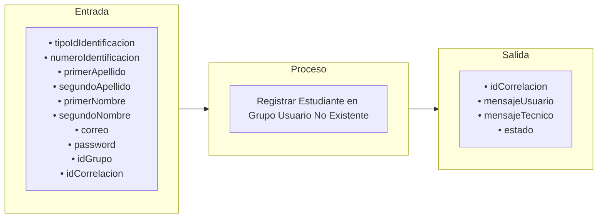

# Transacción: Registrar Estudiante en Grupo (Usuario No Existente)

Documentación de la transacción orquestadora para dar de alta o actualizar a un usuario, asegurar su rol de estudiante y enrolarlo tanto en un grupo como en su programa académico correspondiente.

##  Responsabilidades de la Transacción

La transacción es responsable de los siguientes flujos:
*   Validar id correlacion esta presente
*   Validar si el usuario esta creado
*   Si existe actualizarlo de lo contrario crearlo
*   Registrar estudiante en el grupo
*   Registrar estudiante en programa

--- 

---

---

## 🔍 Reglas de Negocio y Validaciones

### 1. Validaciones Propias de `usp_registrar_estudiante_en_grupo_usuario_no_existente`
*   Validación de Trazabilidad del Programa Académico

### 2. Procedimientos Utilizados y sus Validaciones

*   **`usp_validar_id_correlacion_esta_presente_interno`**
    *   Validación de Correlación

*   **`usp_validar_usuario_existe_por_id_interno`**
    *   Validación de Existencia y Actividad del Usuario

*   **`usp_sincronizar_usuario_interno`**
    *   Validación del Tipo de Documento
    *   Validación de Unicidad
    *   Validación de Formatos

*   **`usp_sincronizar_estudiante_interno`**
    *   Validación del Perfil de Estudiante

*   **`usp_registrar_estudiante_en_grupo_interno`**
    *   Validación de Existencia del Estudiante
    *   Validación de Existencia del Grupo
    *   Validación de Habilitación y Periodo Académico
    *   Validación de Cupos del Grupo
    *   Validación de Cruces de Horario
    *   Validación de Matrícula Duplicada

*   **`usp_registrar_estudiante_en_programa_interno`**
    *   Validación de Consistencia Institucional
