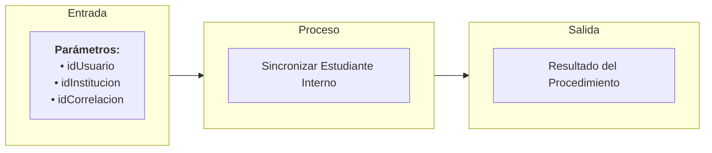

# Transacción: Sincronizar Estudiante Interno

Documentación del procedimiento almacenado para crear o asegurar el rol de estudiante para un usuario dentro de una institución educativa, validando la consistencia de los perfiles en el sistema.

---

## 📥 Parámetros de Entrada

| Parámetro | Tipo | Requerido | Descripción |
| :--- | :--- | :---: | :--- |
| `idUsuario` | `UUID` | Sí | ID del usuario al que se asignará el rol |
| `idInstitucion` | `UUID` | Sí | ID de la institución educativa |
| `idCorrelacion` | `UUID` | Sí | ID de trazabilidad/correlación de la transacción |

---

## 📤 Parámetros de Salida

| Parámetro | Tipo | Descripción |
| :--- | :--- | :--- |
| `idCorrelacion` | `UUID` | Identificador de trazabilidad retornado |
| `mensajeUsuario` | `NVARCHAR` | Mensaje descriptivo para la interfaz de usuario |
| `mensajeTecnico` | `NVARCHAR` | Mensaje técnico de auditoría o error detallado |
| `estado` | `BIT` | Estado final de la transacción (`1` = Éxito, `0` = Fallo) |

---

## 📊 Arquitectura de la Transacción (Entrada - Proceso - Salida)

---

## 📋 Responsabilidades de la Transacción

La transacción es responsable de los siguientes flujos:
*   Validar id correlacion esta presente.
*   Validar existencia e idoneidad del usuario base.
*   Asegurar que exista el perfil de Estudiante en el sistema.
*   Asociar el rol de estudiante al usuario en la institución correspondiente si no está asociado previamente.

---

## 🔍 Reglas de Negocio y Validaciones

### 1. Validaciones Propias de `usp_sincronizar_estudiante_interno`
*   **Validación de consistencia institucional**: El estudiante solo puede ser enrolado en instituciones activas y previamente registradas en la base de datos central.

### 2. Procedimientos Utilizados y sus Validaciones

*   **`usp_validar_id_correlacion_esta_presente_interno`**
    *   Validación de Correlación.

*   **`usp_validar_usuario_existe_por_id_interno`**
    *   Validación de Existencia y Actividad del Usuario.

*   **`usp_validar_perfil_existe_por_codigo_interno`**
    *   Validación del código de Perfil ('ES' - Estudiante).
