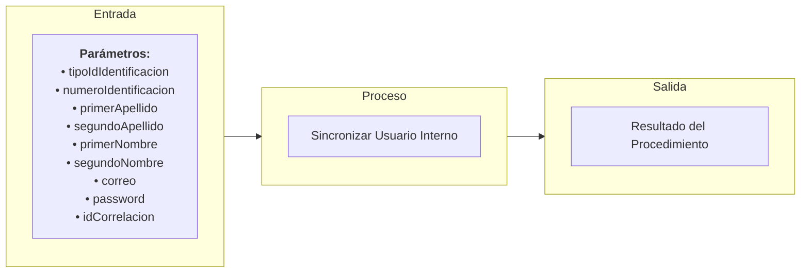

# Transacción: Sincronizar Usuario Interno

Documentación del procedimiento almacenado para crear o actualizar la información básica de un usuario en el sistema.

---

## 📥 Parámetros de Entrada

| Parámetro | Tipo | Requerido | Descripción |
| :--- | :--- | :---: | :--- |
| `tipoIdIdentificacion` | `UUID` | Sí | ID del tipo de identificación |
| `numeroIdentificacion` | `INT` | Sí | Número de documento de identidad |
| `primerApellido` | `NVARCHAR` | Sí | Primer apellido |
| `segundoApellido` | `NVARCHAR` | No | Segundo apellido |
| `primerNombre` | `NVARCHAR` | Sí | Primer nombre |
| `segundoNombre` | `NVARCHAR` | No | Segundo nombre |
| `correo` | `NVARCHAR` | Sí | Dirección de correo electrónico |
| `password` | `NVARCHAR` | No | Contraseña |
| `idCorrelacion` | `UUID` | Sí | ID de trazabilidad/correlación de la transacción |

---

## 📤 Parámetros de Salida

| Parámetro | Tipo | Descripción |
| :--- | :--- | :--- |
| `idCorrelacion` | `UUID` | Identificador de trazabilidad retornado |
| `mensajeUsuario` | `NVARCHAR` | Mensaje descriptivo para la interfaz de usuario |
| `mensajeTecnico` | `NVARCHAR` | Mensaje técnico de auditoría o error detallado |
| `estado` | `BIT` | Estado final de la transacción (`1` = Éxito, `0` = Fallo) |

---

## 📊 Arquitectura de la Transacción (Entrada - Proceso - Salida)

---

## 📋 Responsabilidades de la Transacción

La transacción es responsable de los siguientes flujos:
*   Validar id correlacion esta presente.
*   Validar validez del tipo de identificación en el catálogo.
*   Validar que el correo no esté duplicado con otro usuario.
*   Verificar si ya existe el usuario por tipo/número de documento.
*   Actualizar los datos del usuario si ya existe o insertarlo si es nuevo.

---

## 🔍 Reglas de Negocio y Validaciones

### 1. Validaciones Propias de `usp_sincronizar_usuario_interno`
*   **Validación de Formatos e Integridad**: Los campos obligatorios como nombres y apellidos no deben estar vacíos o con formatos inválidos.

### 2. Procedimientos Utilizados y sus Validaciones

*   **`usp_validar_id_correlacion_esta_presente_interno`**
    *   Validación de Correlación.

*   **`usp_validar_tipo_identificacion_exista_por_id_interno`**
    *   Validación de existencia del tipo de documento de identidad.

*   **`usp_validar_unicidad_usuario_interno`**
    *   Validación de unicidad de correo y de documento en el sistema.
